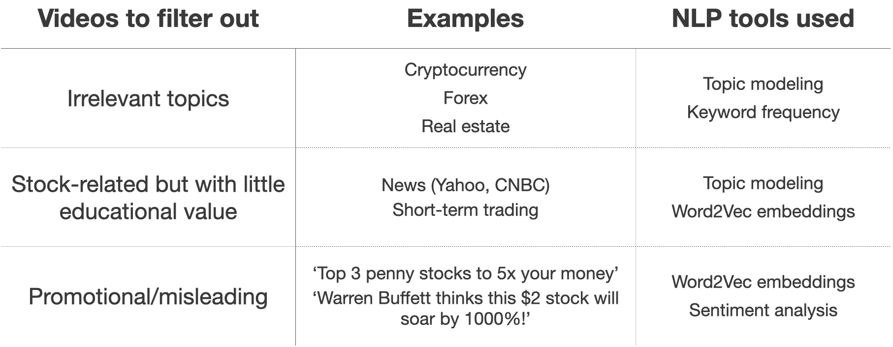
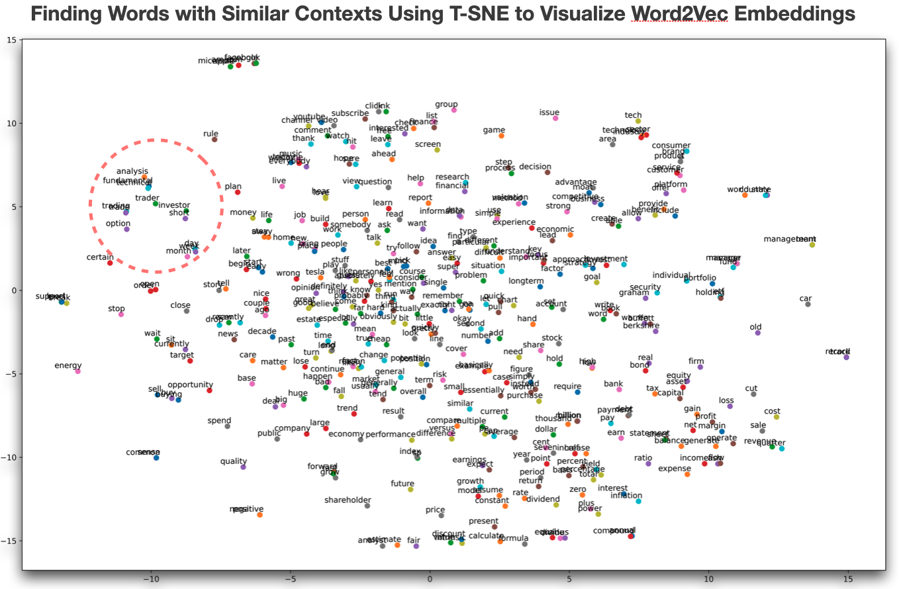
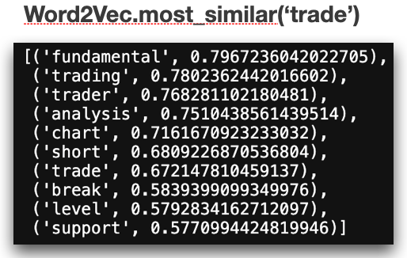
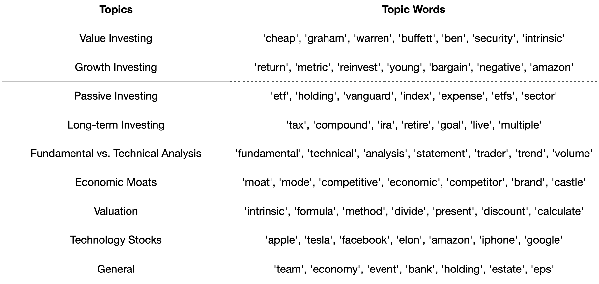

# Building a YouTube video recommender for beginners in stock investing

### Motivation - Incorporating NLP into qualitative investment analysis

- When you are just getting into a new field, it is normal that you seek education on that subject. For example, if you want to learn data science, you take a bootcamp like Metis and practice coding on Leetcode. You want to get up to speed on home improvement skills  - you watch DIY videos. When you invest in a property like a house, you consult a real estate broker, but more importantly, you do on-site due diligence to see for yourself that there are no unpleasant surprises.

- But when it comes to stock investing, many simply refuse to become educated and risk their savings on some hot tips from a friend, and starts becoming obsessed with the daily stock price movements without actually learning.

- So I asked myself, how can I help beginners get properly educated on stock investing? An answer I came up with is a YouTube video recommender that lets the user choose different investment topics to study, and recommends high quality videos with examples and case studies for better learning.

### Data and Tools 

- **Data:** I used Selenium to search about 3000 unique YouTube videos on stock investing using different search queries.

- **Features:** Video ID, title, upload date, duration, views, number of likes, description, transcript.
 
- **Tools used:** Numpy, Pandas, Selenium, BeautifulSoup, NLTK, SpaCy, Seaborn, Matplotlib, Scikit-learn, Streamlit, Heroku.

### Filtering out videos with no educational value

- The main challenge of my project lied in filtering out videos with no educational value. Videos with irrelevant topics such as cryptocurrency were easy to remove using topic modeling. Videos with stock-related topics but providing little educational value, such as news, and short-term trading, were identified to a certain extent using Word2Vec embeddings.

- Word2Vec, combined with sentiment analysis were also helpful in weeding out promotional or misleading videos like shown in the table below. 

- Let me show a quick example of how Word2Vec embeddings and sentiment analysis were used to filter out videos on short-term trading. As a basic rule, short-term trading based on price movements is NOT investing but many have misconception that it is. So I want to remove all videos that promote this concept. But at the same time, I don't want to remove videos just for mentioning short-term trading, that may be telling viewers not to follow this approach. Here is where Word2Vec comes in. I have created a T-SNE plot below that shows embeddings of words that appear in similar contexts. The red circle shows all the words related to trading are clustered together.

- It is hard to see on the chart, so if we run Word2Vec's most similar method, which uses cosine similarity, it gives us words like break, level, support, which are all phrases a YouTuber teaching short-term trading would use.

- I used some of these words as a mask to identify videos that attempt to teach viewers about short-term trading as an investment approach. I then used Vader's sentiment analysis to find videos with very high positive sentiment (scores of >0.9, with 1 being the most positive), because I believed those are more likely to be promotional.

- Using this technique, I was able to capture low quality videos to vastly improve my final topic model and recommender system.

### Final topic model

- My topic model ultimately consisted of nine investment topics, ordered in a logical sequence so that you learn the basics of different investment styles before delving into the tools used in analyzing stocks.

### Creating a two-step content-based recommender

- In creating my recommender system, I had a major cold start problem where a new user is assumed to have no previous interaction with YouTube videos on stock investing. As a solution, I created a two-step content-based recommender - an initial recommender to let a user gauge his topic of interest and desired video style, and a follow-up recommender to make recommendations based on the user's liked videos. 

- Using cosine similarity on CountVectorizer gave the best results, especially for cross-topic recommendations, based on my own domain knowledge.

- Finally, I put my recommender inside a Streamlit app and deployed it publicly via Heroku. **You can visit [here](https://stockinvestingvideorec.herokuapp.com/) to try out my app!** 

**Please check out my blog post on this project [here](https://mikechoi90.medium.com/youtube-video-recommender-for-beginners-in-stock-investing-3c3ddde8b94d)**

**Further plots and results can be found in the [project presentation](Presentation/Metis_Project5_PPT_vF.pdf). The main project code can by found in .py files and Jupyter notebooks located [here](Code).**